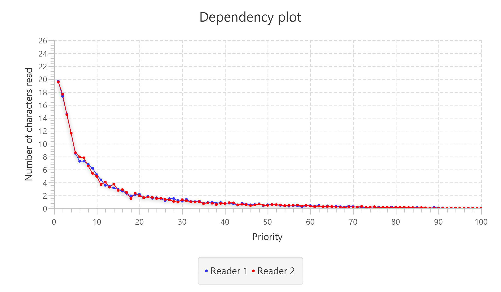

# Simulation of parallel process control

Laboratory works on discipline «Modern problems of computer science». 
This work models management in systems with parallel processes and shared resources.
## Formulation of the problem
Develop a model for controlling access of several parallel processes to one file. It is assumed that the system has read and write processes that access the file in question. At the same time several reading processes can work with it. If the recording process is working, then no other process can access the file until the recording is complete. The transfer of control between processes occurs randomly. The likelihood that control will be transferred to a certain process is proportional to its priority.

## Conclusion
The results are presented in the form of dependences of the number of characters read by each of the reading processes on the priority of the writing process.

